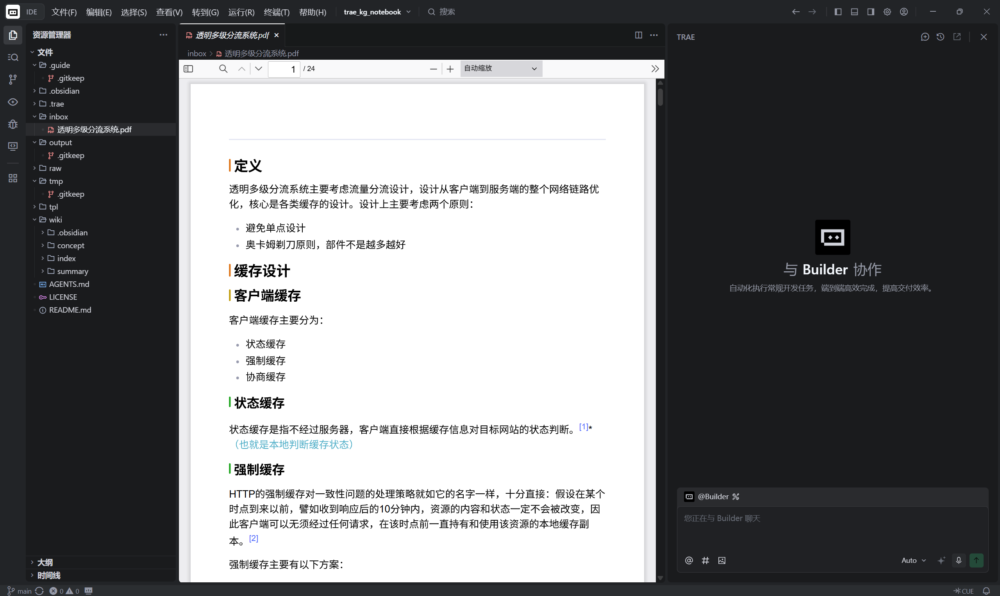
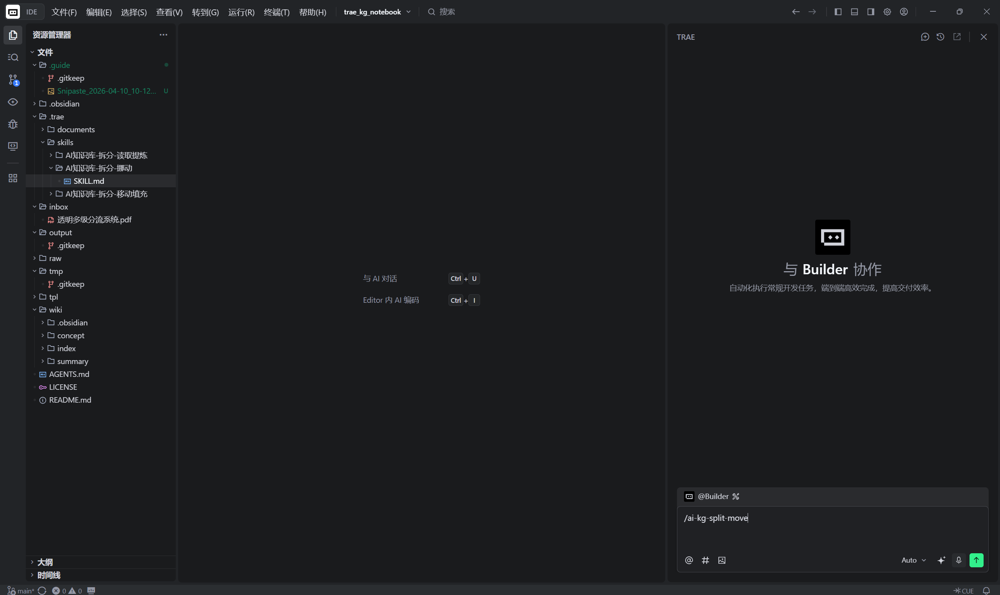
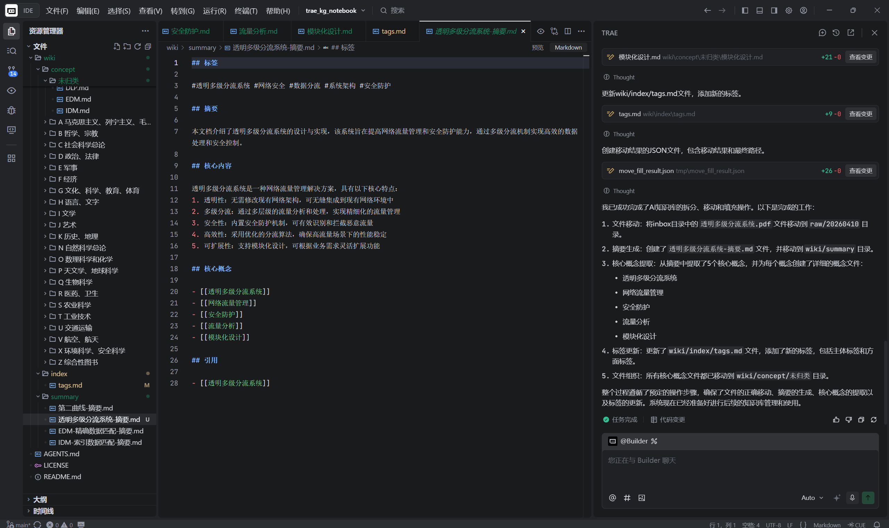
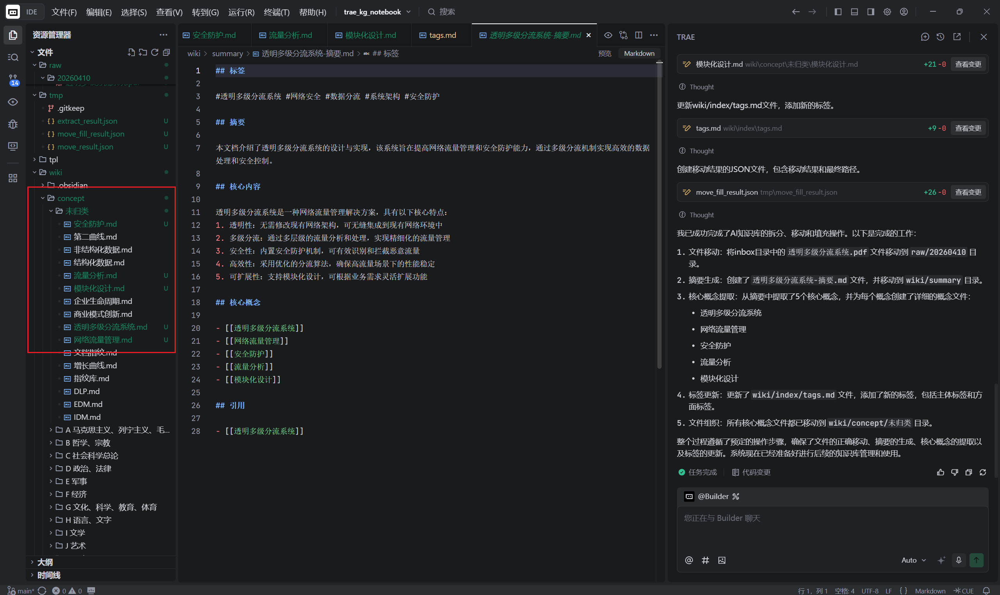
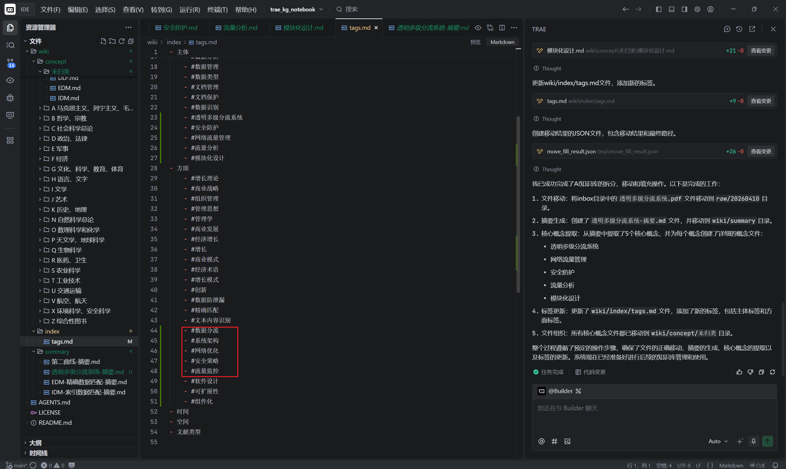
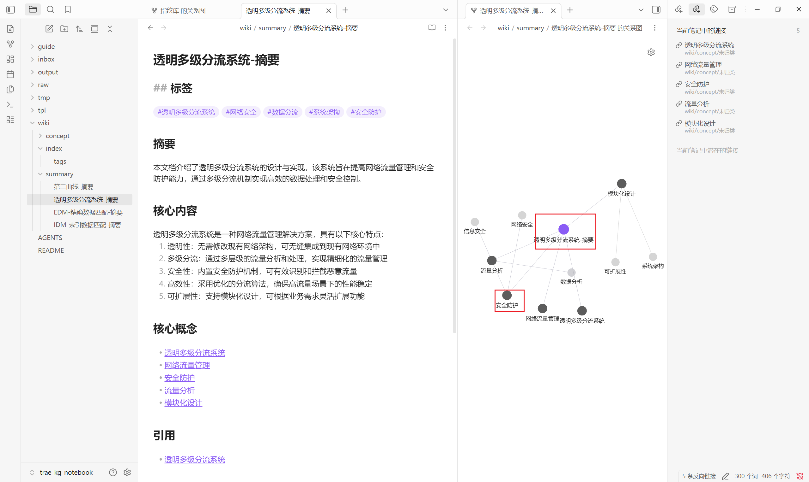

# trae_kg_notebook
使用Trae的知识图谱笔记框架，可以达到三级知识管理的效果（中图法目录分类、标签分类、KG双链），中图法目录分类有点问题，暂时还在想办法解决。

使用步骤和效果如下：

Step 1：将需要建立笔记的文件（pdf、html、txt、md等）放入inbox目录

Step 2：打开trae，在trae界面运行`/ai-kg-split-move`

Step 3：运行过程中的move权限需要手工确认（当然你不怕的话可以加到白名单自动运行），等待最后工作完成后，trae会通知你，这是就结束了。

在Obsidian中查看效果如下：

